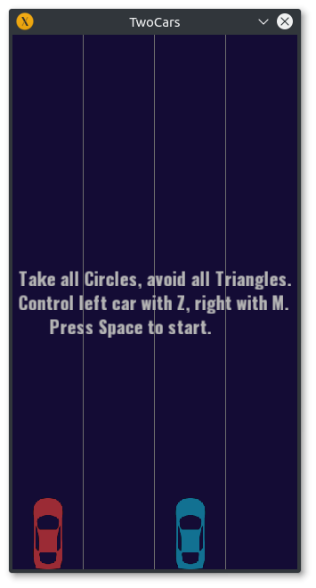
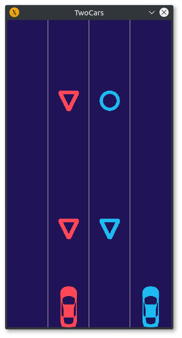
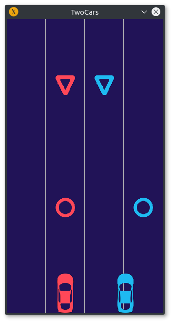
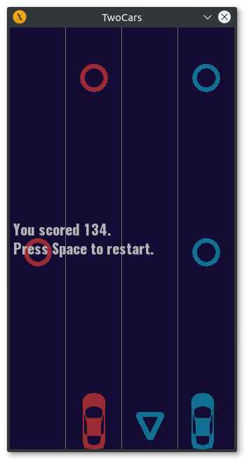

TwoCars
================

A clone of the 2 Cars game in C++14/SFML
TwoCars is a simple 2D endless runner where you simultaneously control two cars while taking all the circles and
avoiding all triangles to keep running.
How much can you score ?

Keybindings: F/J to change lane of the left/right car

Screenshots
-----------------

Video
-----------------
[Watch on YouTube](https://youtu.be/BSCoVgsL9Lg)
